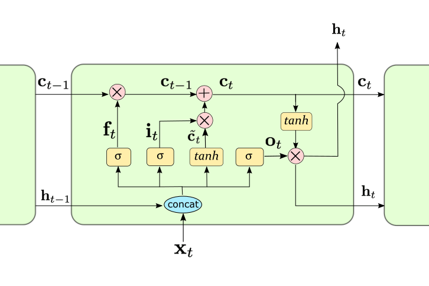

## LSTM

0. 定义
   memory state: $h_t$
   carry state: $c_t$

1. 遗忘门
    顾名思义，遗忘门用来控制在元胞(cell)状态里哪些信息需要进行遗忘，以使在$C_t$流动的过程中进行适当的更新。它接收$h_{t-1}$和$x_t$作为输入参数，通过sigmoid层得到对应的遗忘门的参数。具体公式如下
    $$
        f_t=sigmoid(h_{t-1}@W_{fh} + x_t @ W_{fx} + b_f)
    $$

2. 输入门
   接下来就需要更新细胞状态${C_t}$了。首先LSTM需要生成一个用来更新的候选值，记为$\tilde{C_t}$，通过tanh层来实现。然后还需要一个输入门参数$i_t$来决定更新的信息，同样通过sigmoid层实现。最后将$i_t$和$\tilde{C_t}$相乘得到更新的信息，同时将上面得到的遗忘门$f_t$和元胞状态$C_{t-1}$相乘，以忘掉其中的一些信息，二者相结合，便得到更新后的状态$C_t$。具体公式如下:
    $$
        i_t = sigmoid(h_{t-1}@W_{ih}+x_t@W_{ix}+b_i) 
    $$
    $$
        \tilde{C_t} = tanh(h_{t-1}@W_{ch} + x_t@W_{cx} + b_c)
    $$
    $$
        C_t = f_t \odot C_{t-1} + i_t \odot \tilde{C_t} 
    $$
3. 输出门
    最后，LSTM需要计算最后的输出信息，该输出信息主要由元胞状态$C_t$决定，但是需要经过输出门进行过滤处理。首先要将元胞状态$C_t$的值规范化到[-1,1]，这通过tanh层来实现。然后依然由一个sigmoid层得到输出门参数$o_t$，最后将$o_t$和规范化后的元胞状态进行点乘，得到最终过滤后的结果。具体公式如下:
    $$
        o_t = sigmoid(h_{t-1} @ W_{oh} + x_t @ W_{ox}+ b_o)
    $$
    $$
        h_t = o_t \odot tanh(C_t)
    $$

## GRU

1. 更新门$z_t$
   $$
    z_t = sigmoid(h_{t-1}@W_{zh} + x_t@W_{zx} + b_z)
   $$
   
2. 重置门
   $$
   r_t = sigmoid(h_{t-1}@W_{rh} + x_t@W_{rx} + b_r)
   $$
3. 记忆体
   $$
   h_t = z_t{\odot}h_{t-1} + (1-z_t) \odot \tilde{h}_t
   $$
4. 候选隐藏层
   $$
        \tilde{h}_t = tanh((r_t \odot h_{t-1})@W_h + x_t @ W_x + b_h)
   $$
   