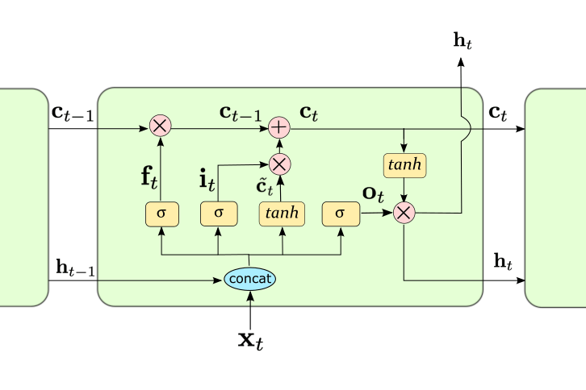

# CNN
## tf.keras.layers.Conv1D
reference: https://blog.csdn.net/yinizhilianlove/article/details/127129520

# RNN

## LSTM

1. 遗忘门
    顾名思义，遗忘门用来控制在元胞(cell)状态里哪些信息需要进行遗忘，以使在$C_t$流动的过程中进行适当的更新。它接收$h_{t-1}$和$x_t$作为输入参数，通过sigmoid层得到对应的遗忘门的参数。具体公式如下
    $$
        f_t=sigmoid(W_f*[h_{t-1},x_t]+b_f)
    $$

2. 输入门
   接下来就需要更新细胞状态${C_t}$了。首先LSTM需要生成一个用来更新的候选值，记为$\tilde{C_t}$，通过tanh层来实现。然后还需要一个输入门参数$i_t$来决定更新的信息，同样通过sigmoid层实现。最后将$i_t$和$\tilde{C_t}$相乘得到更新的信息，同时将上面得到的遗忘门$f_t$和元胞状态$C_{t-1}$相乘，以忘掉其中的一些信息，二者相结合，便得到更新后的状态$C_t$。具体公式如下:
    $$
        i_t = sigmoid(W_i*[h_{t-1},x_t]+b_i) 
    $$
    $$
        \tilde{C_t} = tanh(W_c*[h_{t-1},x_t] + b_c)
    $$
    $$
        C_t = f_t * C_{t-1} + i_t * \tilde{C_t} 
    $$
3. 输出门
    最后，LSTM需要计算最后的输出信息，该输出信息主要由元胞状态$C_t$决定，但是需要经过输出门进行过滤处理。首先要将元胞状态$C_t$的值规范化到[-1,1]，这通过tanh层来实现。然后依然由一个sigmoid层得到输出门参数$o_t$，最后将$o_t$和规范化后的元胞状态进行点乘，得到最终过滤后的结果。具体公式如下:
    $$
        o_t = sigmoid(W_o*[h_{t-1},x_t] + b_o)
    $$
    $$
        h_t = o_t * tanh(C_t)
    $$
